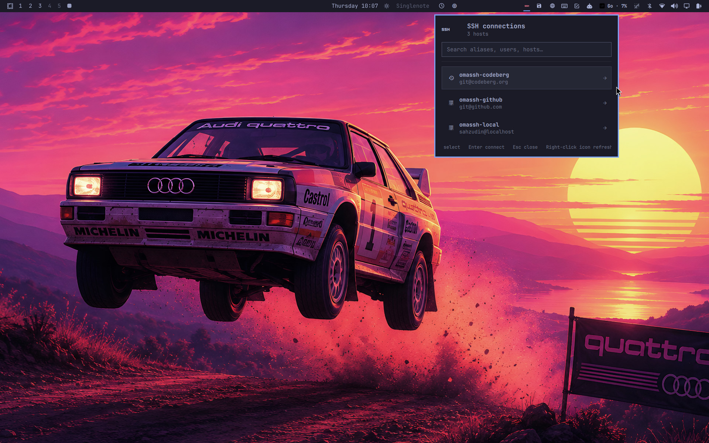

# OmaSSH

OmaSSH is a small, read-only SSH launcher for the Omarchy bar. Click the server
icon, type part of an alias, hostname, or user, and press Enter to connect in
your configured Omarchy terminal.



It uses your OpenSSH configuration as the source of truth. Connections are
launched as `ssh -- <alias>`, so OpenSSH still applies identity files,
`ProxyJump`, forwarding, `Match` rules, and every other option in the config.

## Features

- Reads literal `Host` aliases from `~/.ssh/config`.
- Follows globbed `Include` directives.
- Fuzzy-searches aliases, hostnames, users, ports, and jump hosts.
- Opens the selected connection in Omarchy's configured terminal.
- Places recently used hosts first without modifying the SSH config.
- Refreshes when the main config changes and periodically for included files.
- Uses argument-array process launching; aliases are never interpolated into a shell command.
- Adapts to the active Omarchy theme and horizontal or vertical bars.

Wildcard patterns such as `Host *` and `Host web-*` are intentionally excluded
from the list because they describe rules rather than directly selectable
destinations.

## Requirements

- Omarchy Quattro with the Quickshell plugin system.
- Python 3 using only the standard library.
- OpenSSH and Omarchy's configured terminal launcher.

OmaSSH runs entirely as your normal user account and needs no background
service, stored credentials, or additional Python packages. It accesses the
network only when you deliberately select a host, at which point the normal
OpenSSH client handles the connection.

## Install

Use Omarchy's normal plugin workflow:

```bash
omarchy plugin add https://github.com/sahzudin/omassh.git --enable
```

Plugins execute unsandboxed inside `omarchy-shell`; review third-party plugin
source before installing it.

The widget defaults to the right section. Move it at any time with:

```bash
omarchy bar move io.github.sahzudin.omassh --section right
```

Right-click the bar icon to refresh immediately. The popup supports fuzzy
typing, Up/Down selection, Enter to connect, and Escape to clear or close.

## Configuration

Open Omarchy's bar settings to change:

- `configPath`: defaults to `~/.ssh/config`.
- `refreshIntervalSec`: polling interval for included config files; defaults to 30 seconds.
- `maxHosts`: maximum number loaded into the panel; defaults to 200.

Recent connections are stored at
`${XDG_STATE_HOME:-~/.local/state}/omassh/recent.json` with mode `0600`. OmaSSH
never writes to your SSH config.

## Remove

```bash
omarchy plugin remove io.github.sahzudin.omassh
```

Removing the plugin leaves its small recent-host history in place so a later
reinstall can reuse it. Delete `~/.local/state/omassh/recent.json` as well if
you want to remove that optional local state.

## Development

Run the parser tests and Omarchy manifest validator:

```bash
make test
make validate
```

For live QML development, copy the plugin into
`~/.config/omarchy/plugins/io.github.sahzudin.omassh/` and let Omarchy's plugin
watcher reload edits. The runtime files are `manifest.json`, `Panel.qml`,
`Model.js`, and `bin/omassh-hosts`.

## License

MIT
